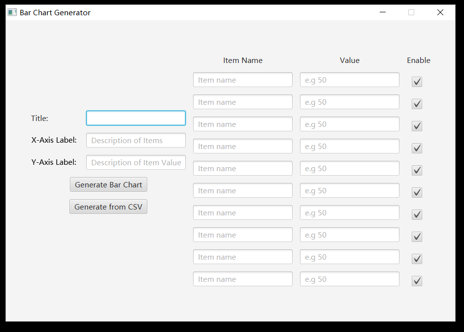
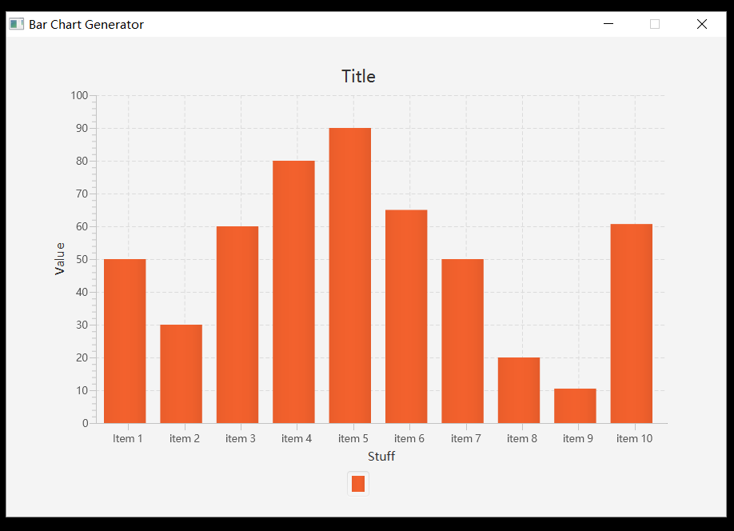

# Bar_Chart_Generator
A bar chart generator written in JAVA that can generate a bar chart by either manually inserting values and names, or importing a CSV file with the right format.  
**Input Interface**  
  
**Sample Result**  

